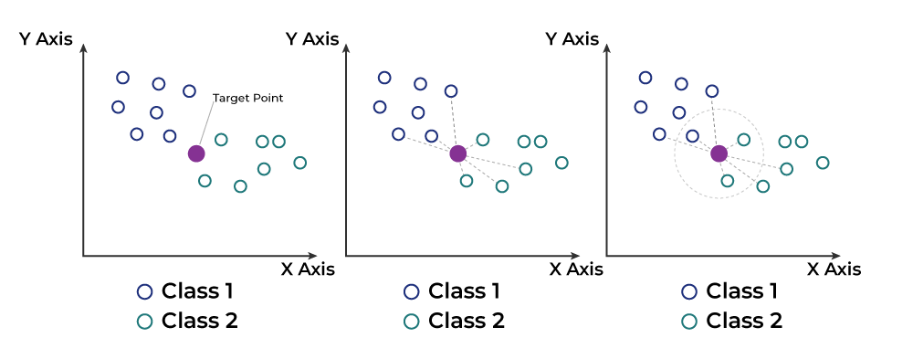

### What is machine learning?
*Machine learning is programming computers to optimize a performance criterion using example data (test data) or past experience.*

### Machine learning process
1. *Data pre-processing*
- Import the data
- Clean the data
- Split into training and test sets
- Feature scaling
2. Modelling
- Build the model
- Train the model
- Make predictions
3. Evaluation 
- Calculate performance metrics 
- Make a verdict. 

### Classification of Machine Learning 

> **Spuervsed Learning** - *Where algorithms are trained on labeled datasets. This labeled data consists of inputs and their corresponding desired outputs, allowing the model to learn the relationship between them and predict outputs for new, unseen data.*

> *Imagine a student learning from a teacher. The teacher provides labeled data (examples with correct answers) like practice problems with solutions. The student (the machine learning model) learns from this data to make predictions on new, unseen problems.*

>*i. Classification- Inputs are divided into two or more classes, and the learner must produce a model that assigns unseen inputs to one or more (multi-label classification) of these classes and predicts whether or not something belongs to a particular class.*

>*ii. Regression: It is also a supervised learning problem, that predicts a numeric value and outputs are continuous rather than discrete. For example, predicting stock prices using historical data.*
-----------------------------------------------
-----------------------------------------------

> *Unsupervised Learning-  No labels are given to the learning algorithm, leaving it on its own to find structure in its input.*

> *Clustering: This technique groups similar data points together based on their characteristics.  Imagine sorting a basket of fruits by color or type. Clustering algorithms identify these inherent groupings without being told what the categories are beforehand.*

> *Sometimes, datasets can have a very high number of features (dimensions).  Dimensionality reduction techniques aim to condense this data into a lower-dimensional space while preserving the essential information.*

> *Association Rule Learning: This approach discovers relationships between items or events within a dataset.*

 > *Generative Models: After a model captures the probability distribution of your input data, it will be able to generate more data.*

------------------------------------
----------------------
> *Reinforcement learning- It is like learning through trial and error. Imagine training a dog with treats. The dog (the agent) takes actions (tries different behaviors) and receives rewards (treats) for good actions and penalties for bad actions. Over time, the dog learns which actions lead to rewards.*


| Feature | Supervised Learning | Unsupervised Learning | Reinforcement Learning |
| ------ | -------------------- | ------------------ | ---------------- |
Data Type | Labeled | Unlabeld | No predefined data |
Learning Style | Learning from example | Finding patterns | Tria and error |
Task Type | Classification, Regression | Clustering, Demensionality Reduction | Control, Optimization |

~~~ 
Terminologies of Machine learning-

Model - A model is a specific representation learned from data by applying some machine learning algorithm. A model is also called a hypothesis.

Feature- A feature is an individual measurable property of our data. A set of numeric features can be conveniently described by a feature vector. Feature vectors are fed as input to the model.

Target (Label)- A target variable or label is the value to be predicted by our model.

Training -The idea is to give a set of inputs(features) and its expected outputs(labels), so after training, we will have a model (hypothesis) that will then map new data to one of the categories trained on.

Prediction -Once our model is ready, it can be fed a set of inputs to which it will provide a predicted output(label).

~~~


*Photo_courtesy- Geeks for Geeks*

### What is feature scaling ?
> IT is a technique to standardize the independent features present in the data in a fixed range.It is performed during the data pre-processing.

-----------
-----------
-----------

## Now we are try to learning some supervised machine learning technique with python code .

- Linear Regreddion 

*Defination-  Linear regression is a statistical method for modeling relationships between a dependent variable with a given set of independent variables.*

```python 
import numpy as np
from sklearn.linear_model import LinearRegression

# Sample data
x = np.array([1, 2, 3, 4, 5,6])
y = np.array([2, 4, 6, 8, 10, 12])

# Create a linear regression model object
model = LinearRegression()

# Train the model on the data
model.fit(x.reshape(-1, 1), y)  # Reshape x for compatibility cause LinearRegression class need 2D array as input.

# Print the intercept and slope
print("Intercept:", model.intercept_)
print("Slope:", model.coef_[0])  # Access slope coefficient from weights

# Predict a new value for x = 8
new_x = 8
predicted_y = model.predict([[new_x]])  # Reshape input for prediction

print("Predicted y for x =", new_x, ":", predicted_y[0])

Output : Predicted y for x = 8 : 15.999999999999998

```

- Multiple Linear Regression 
``` python 
import numpy as np
from sklearn.linear_model import LinearRegression

# Sample data (you can replace this with your own data)
x = np.array([[1, 2], [3, 4], [5, 6], [7, 8]])  # Multiple features in each row
y = np.array([2, 5, 7, 10])

# Create a linear regression model object
model = LinearRegression()

# Train the model on the data
model.fit(x, y)

# Print the intercept and coefficients
print("Intercept:", model.intercept_)
print("Coefficients:", model.coef_)  # Array of coefficients for each feature

# Predict a new value for x = [9, 10]
new_x = np.array([9, 10])
predicted_y = model.predict([new_x])

print("Predicted y for x =", new_x, ":", predicted_y[0])


Output: Predicted y for x = [10, 12] : 14.449999999999996
```
- Polynomial Regression 
``` python 

import numpy as np
from sklearn.preprocessing import PolynomialFeatures
from sklearn.linear_model import LinearRegression

# Sample data (you can replace this with your own data)
x = np.array([1, 2, 3, 4, 5])
y = np.array([2, 4, 5, 4, 5])

# Degree of the polynomial 
degree = 2

# Create a PolynomialFeatures object to generate polynomial terms
transformer = PolynomialFeatures(degree=degree)

# Generate polynomial features from the original features
x_transformed = transformer.fit_transform(x.reshape(-1, 1))  # Reshape for compatibility

# Create a linear regression model object
model = LinearRegression()

# Train the model on the transformed data
model.fit(x_transformed, y)

# Print the coefficients (including intercept term)
print("Coefficients:", model.coef_)  # Array of coefficients for polynomial terms

# Predict a new value for x = 6
new_x = 6
new_x_transformed = transformer.transform([[new_x]])  # Transform new data point

predicted_y = model.predict(new_x_transformed)

print("Predicted y for x =", new_x, ":", predicted_y[0])

Output: Coefficients: [0.00000000e+00 2.00000000e+00 1.99840144e-15]
Predicted y for x = 12 : [24.]

```
- Bayesian Regression 
- Quantile Regression 
- Isotonic Regression 
- Stepwise Regression 
- Logistic Regression 


> K-NN model(K-Nearest Neighbors)

> KNN works by assuming that data points close together in feature space are likely to have similar labels or values.
In simpler terms, similar data points tend to belong to the same category



``` python 
# Import important libraries
from sklearn.neighbors import KNeighborsClassifier
from sklearn.datasets import load_iris
from sklearn.model_selection import train_test_split
from sklearn.metrics import accuracy_score

# Load the Iris dataset (commonly used for KNN examples)
iris = load_iris()
X = iris.data  # Features
y = iris.target  # Target labels (iris flower types)

# Split data into training and testing sets
X_train, X_test, y_train, y_test = train_test_split(X, y, test_size=0.2, random_state=42)

# Define the KNN model with k=5 neighbors 
knn = KNeighborsClassifier(n_neighbors=5)

# Training the data set
knn.fit(X_train, y_train)

# Make predictions on the testing data
y_pred = knn.predict(X_test)

# Evaluate model performance (accuracy)
accuracy = accuracy_score(y_test, y_pred)
print("Accuracy:", accuracy)


```

> SVM(Support Vector Machine)- A supervised learning algorithm that can be used for classification or regression tasks. SVMs try to find the hyperplane in a high-dimensional space that maximally separates different classes or output values.
It works for both Classification and Regressions(SVR-Support Vector Regression).


``` python 
# Importing important libraries
from sklearn.svm import SVR
from sklearn.datasets import load_boston
from sklearn.model_selection import train_test_split
from sklearn.metrics import mean_squared_error

# Load the Boston house price dataset 
boston = load_boston()
X = boston.data  # Features (various house characteristics)
y = boston.target  # Target variable (house price)

# Split data into training and testing sets
X_train, X_test, y_train, y_test = train_test_split(X, y, test_size=0.2, random_state=42)

# Define the SVR model with a linear kernel (adjustable)
svr_model = SVR(kernel='linear')

# Train the SVR model on the training data
svr_model.fit(X_train, y_train)

# Make predictions on the testing data
y_pred = svr_model.predict(X_test)

# Evaluate model performance using mean squared error (MSE)
mse = mean_squared_error(y_test, y_pred)
print("Mean Squared Error:", mse)

```
